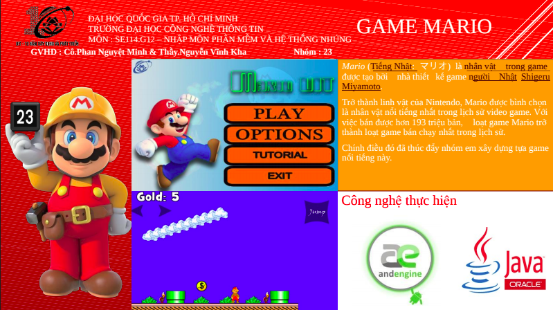
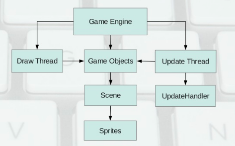
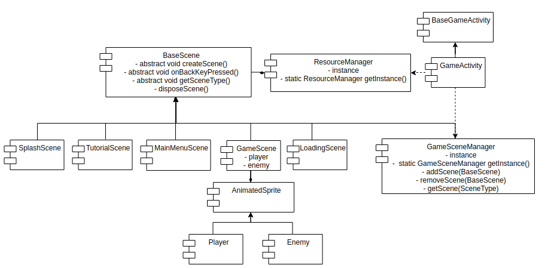

# DoAnMario
```text
This is mario game.
Technical stack:
- Andengine framework
- Java
```
## Overview of application


## Game architecture


## Application architecture


## Technical Support or Questions
If you have questions or need help integrating the product please "thanh29695@gmail.com" instead of opening an issue
